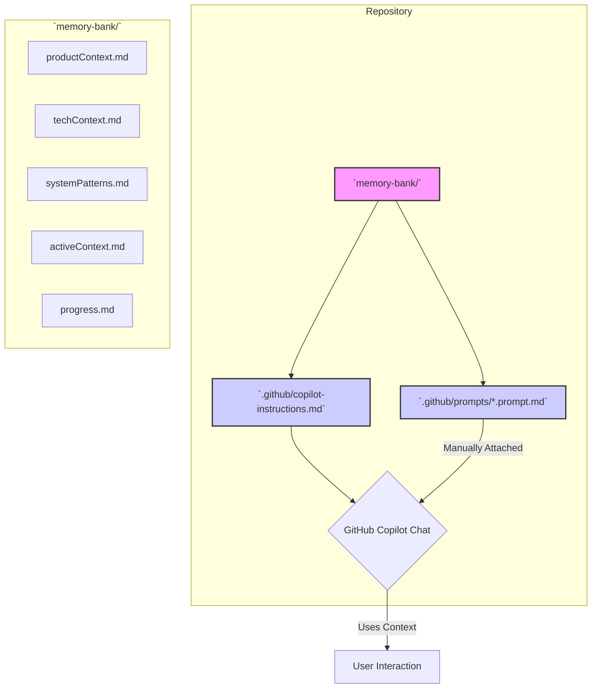

# System Patterns: Copilot Memory Bank

## System Architecture

The Copilot Memory Bank system relies on integrating structured context files with GitHub Copilot's native customization features.

*   **`.github/copilot-instructions.md`**: The primary entry point. Contains instructions for Copilot to reference and prioritize context from the `memory-bank/` directory. May contain condensed key context directly.
*   **`memory-bank/`**: A dedicated directory holding structured Markdown files detailing different aspects of the project context (Product, Tech, Patterns, Active, Progress).
*   **`.github/prompts/*.prompt.md` (Optional/Exploratory)**: Task-specific prompt files that can reference `memory-bank/` files to provide deep context for specific actions (e.g., code generation, reviews). These require manual attachment by the user.

## Key Technical Decisions

*   **Leverage Native Features:** Prioritize using built-in Copilot features (`copilot-instructions.md`, `*.prompt.md`) over external tools or extensions.
*   **Structured Context:** Adopt a multi-file structure within `memory-bank/` inspired by Cline Memory Bank for clarity and maintainability.
*   **Markdown Format:** Use Markdown for all context files due to its simplicity and readability.
*   **Repository-Scoped:** Focus context at the repository level.

## Design Patterns

*   **Context Injection:** Using `copilot-instructions.md` to automatically inject awareness of the `memory-bank/` structure into Copilot.
*   **Modular Context:** Separating context into distinct files (`productContext.md`, `techContext.md`, etc.) for better organization.
*   **Task-Specific Prompts (via Prompt Files):** Encapsulating complex, context-aware tasks into reusable prompt files.

## Component Relationships

*   `copilot-instructions.md` acts as the central coordinator, directing Copilot's attention to the `memory-bank/` files.
*   `memory-bank/` files serve as the knowledge base.
*   `*.prompt.md` files act as specialized tools that draw upon the knowledge base for specific tasks.
